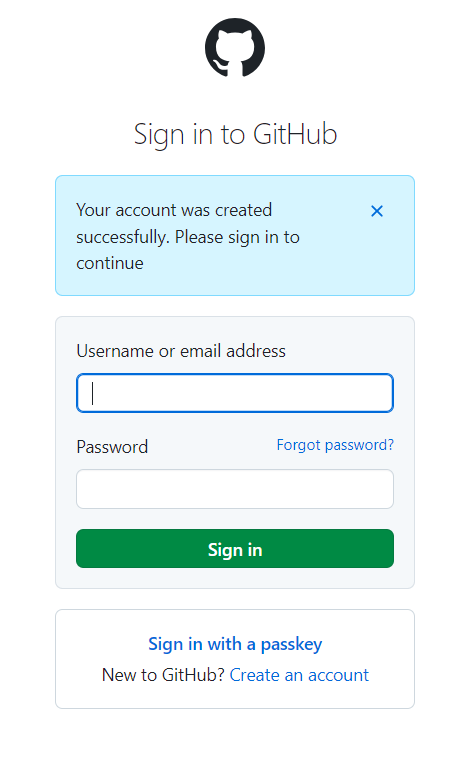
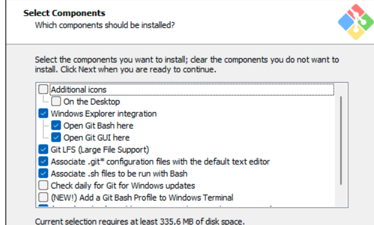
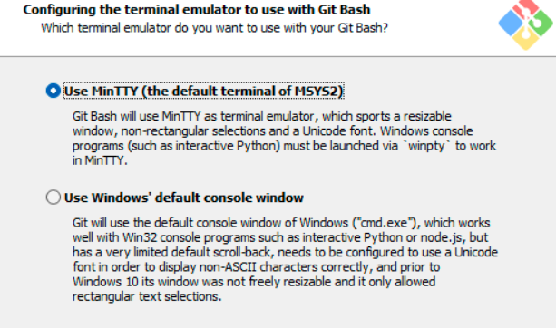
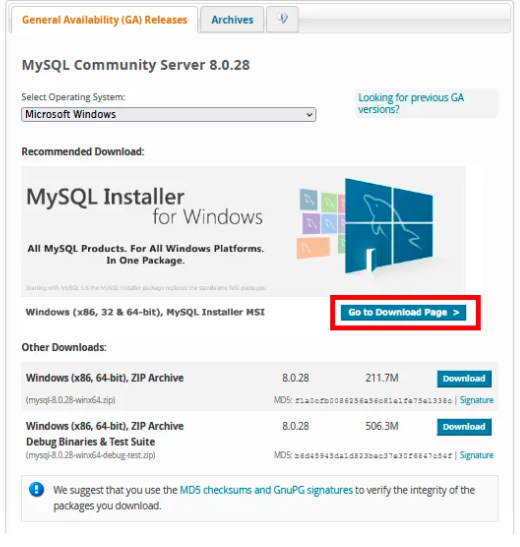
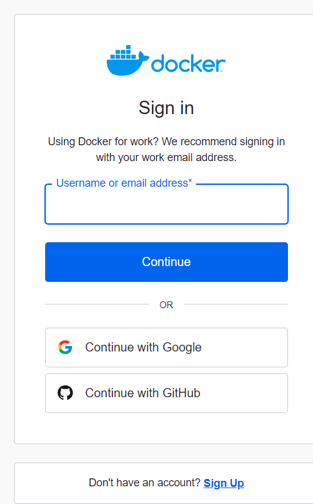

# Dev_Setup
Setup Development Environment

#Assignment: Setting Up Your Developer Environment

#Objective:
This assignment aims to familiarize you with the tools and configurations necessary to set up an efficient developer environment for software engineering projects. Completing this assignment will give you the skills required to set up a robust and productive workspace conducive to coding, debugging, version control, and collaboration.

#Tasks:

1. Select Your Operating System (OS):
   Choose an operating system that best suits your preferences and project requirements. Download and Install Windows 11. https://www.microsoft.com/software-download/windows11

 Upgraded windows 10 https://www.microsoft.com/en-us/software-download/windows10%20

2. Install a Text Editor or Integrated Development Environment (IDE):
   Select and install a text editor or IDE suitable for your programming languages and workflow. Download and Install Visual Studio Code. https://code.visualstudio.com/Download

3. Set Up Version Control System:
   Install Git and configure it on your local machine. Create a GitHub account for hosting your repositories. Initialize a Git repository for your project and make your first commit. https://github.com

https://www.git-scm.com/downloads

4. Install Necessary Programming Languages and Runtimes:
  Instal Python from http://wwww.python.org programming language required for your project and install their respective compilers, interpreters, or runtimes. Ensure you have the necessary tools to build and execute your code.

5. Install Package Managers:
   If applicable, install package managers like pip (Python).

    http://wwww.python.org

6. Configure a Database (MySQL):
   Download and install MySQL database. https://dev.mysql.com/downloads/windows/installer/5.7.html

7. Set Up Development Environments and Virtualization (Optional):
   Consider using virtualization tools like Docker or virtual machines to isolate project dependencies and ensure consistent environments across different machines.

. https://docs.docker.com/desktop/install/windows-install/

8. Explore Extensions and Plugins:
   Explore available extensions, plugins, and add-ons for your chosen text editor or IDE to enhance functionality, such as syntax highlighting, linting, code formatting, and version control integration.

9. Document Your Setup:
    Create a comprehensive document outlining the steps you've taken to set up your developer environment. Include any configurations, customizations, or troubleshooting steps encountered during the process. 

             Operating System
    Press on the link https://www.microsoft.com/software-download/windows11
Before installing, l press on https://www.microsoft.com/en-us/windows/windows-11#pchealthcheck to confirm if my device meets the minimum system requirements for Windows 11 
Scroll down until til you see the box (Check for compatibility)
Then click https://www.microsoft.com/en-us/windows/windows-11-specifications#table1
Then download PC Health check app https://aka.ms/GetPCHealthCheckApp
Open and install the app then you should see this image 
Then Click on Check now
It shows me the results as follws 
Run Settings > Update & Security > Windows Security > Device Security > security processor details
Then is shows this 
l ended up failing to install windows 11 and upgraded Windows 10 and its working perfectly .

              For Visual Studio Code 
Click the link  https://code.visualstudio.com/Download 
   Click on download Windows 10,11
   Then l Open  my downloads and run Visual Studio Code 
   Click on Accept the agreement Then click next
   Here I didnt change the location of VSCode stepup  l then pressed next
   Also pressed next 
   I clicked in the box create a desktop icon and all of the other boxes 
    Then l clicked on install
   Then i pressed finish 
   Visual Studio Code is now installed and i was ready to code 

            Github
Click the link https://github.com 
Press signup 
Inserted my email address 
i then created a password 
 went on to create a username and press continue
Press Verify account 

Enter code sent to email 
Then i sucessfully created an account 
 I followed the next step by clicking that l am a student and i will work with 50+ people and press continue
I choose the all tools  ,continue
Press  key continue for free 
Then l can start creating repositories 

            Git
Click the link and download https://www.git-scm.com/downloads 
Once download is done  click next
I didn't change where i want to save it ,i clicked next
Clicked on the boxes  and clicked next
Didn't change menu folder and clicked next 
Clicked on use as notepad and clicked next 
Choose option 2 and clicked next 
 choose option 1 and clicked next
 choose option 1 and clicked next
 choose option 1 and clicked next
 choose option 1 and clicked next
choose option 1 and clicked next
 choose option 1 and clicked next
 choose option 1 and clicked next
Just clicked install 

Open git bash run as administrator 
 Installed successfully

            Python installation
Click the link http://wwww.python.org 
It opened to this 
Then press download Python
When it was done l clicked on run then this popped up 
I then clicked on both boxes on the very end and click on install now
Clicked all optional features 
And click next , advanced options appear  and install
Then the setup is complete and was successfull 
l further added a path by:
   Copy link on where python is installed 
   Search enviroment variables in my windows 
   Click on environment variables 
   Click on path  and click edit
   Click add new  and press ok

   Then l confirmed if Python is installed: py --version
          
              PIP
To check: pip -- version 

             MySQL
click the link https://dev.mysql.com/downloads/windows/installer/5.7.html 
Download on the Windows installer communty  l choose option 2
 I pressed no thanks and proceed 
And l chose to customise it 
 l pressed next after customising it
 clicked on the options l wanted ad pressed next
I was ready to install  and pressed execute
 l pressed next
Ready to configure and press next 
l didn't change the port number and l ticked the advanced and logging options 
 chose for a strong password and press next
Chose a password that i can't forget and l didn't add a new user, press next 
 press next
 press execute , and press finish
Product configure and press next , and press finish 
Connect to server and press next 
Press execute and finish 
lnstallation complete  ,
 Then i was ready to create database ,

              lnstallation of Docker
 Search for Docker installation https://docs.docker.com/desktop/install/windows-install/
 l choose windows x86_64 
 Run when it finishes installing 
 When its done this page will appear 
 Click continue and logout then the windows will restart
 Signup if you don't have an account 
 I clicked on proceed to desktop
 Then i was able to log in 
 l then opened Windows powershell, if l installed it correctly by: Docker --version 

                   Extensions nad Plugins
I imstalled extensions by:
     Open Visual Studio Code
     Clicked on left icon 'Extensions' 
     L installed coderunner by selecting on search Code runner and install 
     Search Dart and install 
     Search Flutter and install 
     Search Prettier and install  
     Search Python debugger and install 

Troubleshootings 

I had issues installing my Sql and l had to install workbench manually
l could not install windows 11 due to my PC not meeting the windows 11 requirements and l even restarted my PC to enable the TPM but still failed to install.
